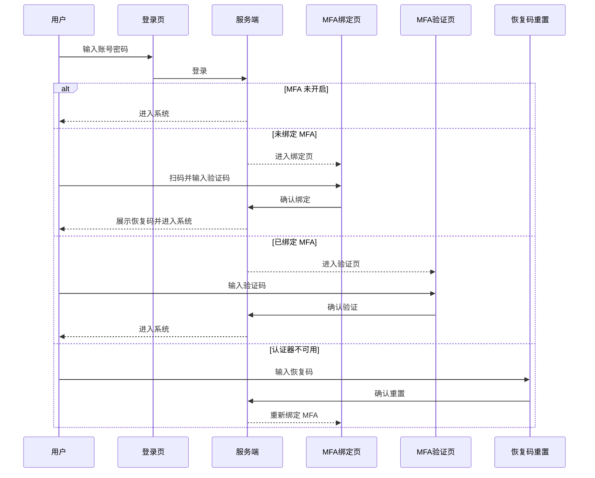

# MFA 认证简版方案

## 0. 目标

在现有登录体系中增加可配置 MFA 认证能力，默认关闭，不影响原有登录流程。

开启后：

```text
用户名密码校验成功 -> 绑定或验证 MFA -> 创建正式登录态
```

## 1. 总览


## 2. 配置

新增 `jianghuConfig` 配置：

| 字段 | 说明 | 默认值 |
|---|---|---|
| `enableMfaVerification` | 是否启用 MFA 检查 | `false` |
| `mfaServiceIssuer` | MFA 应用中显示的颁发者 | `未配置应用名` |
| `mfaTableName` | MFA 写入表名 | `_user_mfa` |
| `mfaSecretEncryptKey` | MFA secretKey 加密密钥 | `空` |

## 3. 数据库

### MFA 存储表

写入表使用 `_user_mfa`，读取统一使用 `_view01_user_mfa`。

```text
_user_mfa
  - id
  - userId
  - isEnabled
  - encryptedSecretKey
  - recoveryCodeHash
  - bindAt
  - lastVerifiedAt
  - resetAt
  - operation
  - operationByUserId
  - operationByUser
  - operationAt
```

字段说明：

| 字段 | 说明 |
|---|---|
| `isEnabled` | 是否已完成 MFA 绑定 |
| `encryptedSecretKey` | 加密后的 TOTP secret |
| `recoveryCodeHash` | 恢复码 hash 值 |

## 4. 服务端流程

### Service 划分

```text
user.js
  - passwordLogin
  - 登录后统一创建 session/authToken

mfa.js
  - 写入 / 读取 mfaPending
  - 生成绑定信息
  - 校验 TOTP
  - 校验恢复码
  - 写入 MFA 表
```

### 临时态

密码通过后，先把临时态放进 `cacheStorage`，而不是正式 session。

```text
key: mfaPending_${appId}_${deviceId}
value: {
  userId,
  deviceId,
  deviceType,
  createdAt,
  retryCount,
  mfaMode
}
```

`mfaMode` 可取：

```text
bind   -> 进入绑定流程
verify -> 进入验证流程
```

### 登录流程

```text
1. passwordLogin 校验账号密码
2. enableMfaVerification=false -> 直接登录
3. enableMfaVerification=true
   - 未绑定 MFA -> 写入 mfaPending，返回 needMfaBind
   - 已绑定 MFA -> 写入 mfaPending，返回 needMfaVerify
4. MFA 成功后再创建 _user_session 和 authToken
5. 成功后删除 mfaPending
```

## 5. 页面

### `loginV4.html`

负责用户名密码登录。

返回结果分支：

```text
success + authToken        -> 正常进入系统
needMfaBind=true           -> 跳转 mfaBind.html
needMfaVerify=true         -> 跳转 mfaVerify.html
```

### `mfaBind.html`

用于绑定 MFA：

```text
1. 从 cacheStorage 对应临时态读取绑定信息
2. 展示二维码 / 手动密钥
3. 输入 6 位验证码确认绑定
4. 返回恢复码，仅展示一次
```

### `mfaVerify.html`

用于验证 MFA：

```text
1. 从 cacheStorage 对应临时态读取验证信息
2. 输入 6 位验证码
3. 验证成功后创建正式登录态
4. 支持输入恢复码重置 MFA
```

## 6. 恢复码

绑定成功时生成恢复码，数据库只存 hash，不存明文。

```text
绑定成功 -> 生成 recoveryCode -> 展示一次 -> 存 recoveryCodeHash
```

恢复码使用后：

```text
1. 失效旧 MFA
2. 清空旧 secret / 恢复码 hash
3. 重新进入绑定流程
```


